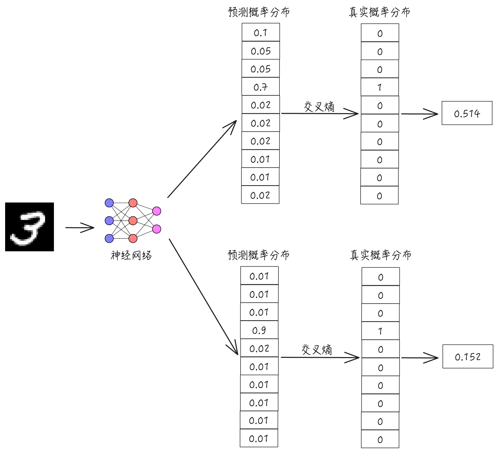

交叉熵损失函数是机器学习中常用的一个损失函数，它衡量了预测概率分布和真实概率分布之间的差异。预测分布越接近真实分布，交叉熵损失越小；预测分布越远离真实分布，交叉熵损失越大。

假设我们正在开发一个用于识别手写数字的模型（比如 MNIST 数据集上的分类任务），这个模型的任务是预测一张图片代表从 0 到 9 的哪个数字。现在已经训练好了一个神经网络模型，它的输出是 10 个数字所对应的概率分布。

{ width="450"}

比如，对上面这张图像，它的输出是：

```python
[0.1, 0.05, 0.05, 0.7, 0.02, 0.02, 0.02, 0.01, 0.01, 0.02]
```

也就是我们所说的预测概率分布，记为 $P$。由于这张图真正包含的数字是 3，于是它的真实概率分布为

```python
[0, 0, 0, 1, 0, 0, 0, 0, 0, 0]
```

记为 $Q$，通过交叉熵的计算公式
​$$
H(P,Q) = - \sum_{i=1}^{n} q_i \log_2 p_i
$$

可计算得：

$$
H(P,Q) = -(0*log_20.1+0*log_20.05+0*log_20.05+1*log_20.7+0*log_20.02+0*log_20.02+0*log_20.0+0*log_20.01+0*log_20.01+0*log_20.02) \approx 0.514
$$

假设我们对上面的神经网路模型又进行了进一步的训练，对上面同样的一张图像，它输出的预测概率分布是：

```python
[0.01, 0.01, 0.01, 0.9, 0.02, 0.01, 0.01, 0.01, 0.01, 0.01]
```

计算交叉熵可得:

$$
H(P,Q) = -(0*log_20.01+0*log_20.01+0*log_20.01+1*log_20.9+0*log_20.02+0*log_20.01+0*log_20.01+0*log_20.01+0*log_20.01+0*log_20.01) \approx 0.152
$$

由于第二次输出的预测概率分布更接近真实的概率分布，所以交叉熵的值也从 $0.5145$ 变成了 $0.152$。在实际中，我们就是通过不断地降低训练数据所对应的交叉熵的值来优化整个神经网络的预测效果。在求交叉熵时，其中的对数计算可以以 $2$ 为底，也可以以 $e$ 为底。

交叉熵概念的起源可以追溯到 1948 年，这一年克劳德·香农

{ width="450"}

在其划时代的论文《通信的数学原理》中提出了信息熵的概念，其定义如下： 

设有一个离散随机变量 $X$，它可能取值为 $\{x_1,x_2,...,x_n\}$，对应的概率分布为 $P(X=x_i)=p_i$，其中满足：

$$
​\sum_{i=1}^{n} p_i = 1,\quad 0 \leq p_i \leq 1
$$

信息熵 $H(X)$ 定义为：

$$
​H(X) = - \sum_{i=1}^{n} p_i \log_2 p_i
$$

其中对数底数为 2，单位是**比特（bit）**，也可以使用自然对数，单位是**nat**。信息熵定义了描述一个事件的状态所需要的平均信息量。